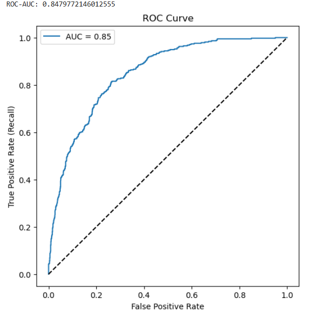

# 📉 Customer Churn Prediction & Survival Analysis API

An end-to-end Machine Learning project that predicts whether a telecom customer is likely to churn and provides business insights using **EDA, Feature Importance, Confusion Matrix, and Survival Analysis**.  
The trained model is deployed as a **FastAPI REST API** and containerized using **Docker**.

📌 Project Description 

This project focuses on predicting customer churn in the telecom industry using machine learning and survival analysis. The goal is to identify customers who are likely to leave the service and understand the factors and time patterns that influence churn behavior.

The project begins with exploratory data analysis to study churn trends across customer segments such as contract type, payment method, and internet service. Feature importance analysis is used to identify the key drivers of churn, while classification models are trained to predict whether a customer will churn.

In addition to traditional classification, the project applies Kaplan–Meier survival analysis to analyze customer retention over time and compare survival probabilities across different customer groups. This provides deeper business insights into when customers are most likely to churn, not just whether they will churn.

The trained machine learning pipeline is deployed as a FastAPI-based REST API with input validation, model versioning, and health checks. The entire application is containerized using Docker and published to Docker Hub, making it easy to deploy and run consistently across environments.

Overall, this project demonstrates an end-to-end workflow covering data analysis, machine learning modeling, interpretability, survival analysis, and production-ready deployment.

---

## 🚀 Project Overview

Customer churn directly impacts revenue in the telecom industry.  
This project helps identify customers who are likely to churn so companies can proactively retain them using targeted strategies.

The project includes:
- Exploratory Data Analysis (EDA)
- Feature Importance analysis
- Classification modeling
- Survival analysis using Kaplan–Meier
- REST API deployment
- Dockerized production-ready setup

---

## 🧠 Model Performance

```
            precision    recall  f1-score   support

           0       0.92      0.74      0.82      1035
           1       0.53      0.81      0.64       374

    accuracy                           0.76      1409
   macro avg       0.72      0.78      0.73      1409
weighted avg       0.81      0.76      0.77      1409
```


📌 **Why Recall Matters More Than Precision**  
In churn prediction, missing a churner is more costly than incorrectly flagging a loyal customer.  
This model prioritizes high recall to capture maximum churn-prone users.
- **Accuracy:** ~76%
- **Recall (Churn = 1):** ~81%
- **Precision (Churn = 1):** ~53%

---

## ⏳ Survival Analysis (Kaplan–Meier)

Survival analysis helps understand **how long customers stay** before churning.

### 🔹 Customer Survival Over Time

**Insight:**  
“This shows how customer survival decreases over time.
Most churn happens in the early months, which highlights the importance of early engagement.”

### 🔹 Average Churn Rate by Contract
Customers with **month-to-month contracts** have a significantly higher churn rate compared to long-term contracts.


**Insight:**  
“Month-to-month customers churn much earlier than customers on one-year or two-year contracts.
This suggests long-term contracts help improve retention

---

### 🔹 Survival by Payment Method


**Insight:**  
Electronic check users churn faster compared to other payment methods.
Customers using electronic check tend to churn faster than those using automatic payment methods.
This may be due to payment friction or missed payments.”

---

### 🔹 Survival by Internet Service


**Insight:**  
Fiber optic users show higher churn risk compared to DSL users.
“Fiber optic customers show higher churn compared to other services, possibly due to higher cost or service expectations.”

---
### 🔹 Survival by Monthly Charges (Binned)


**Insight:**  
Customers with higher monthly charges tend to churn faster, indicating price sensitivity or perceived value issues.”
```
```
## 📊 Exploratory Data Analysis (EDA)

### 🔹 Confusion Matrix
Shows how well the model distinguishes between churned and non-churned customers.


**Insight:**
- High true positives → good churn detection
- Some false positives → acceptable tradeoff for retention strategy

---

### 🔹 ROC-CURVE



**Insight:**

“The ROC curve compares True Positive Rate vs False Positive Rate at different probability thresholds.
My model achieved an AUC of 0.85, meaning it can correctly distinguish churn vs not churn customers 85% of the time, which is a strong performance for telecom churn problems.”

#### 📈 Understanding the Graph

- X-Axis → False Positive Rate
- (FPR = how many NON-CHURN customers we incorrectly say “will churn”)

- Y-Axis → True Positive Rate
- (TPR / Recall = how many churn customers we correctly catch)

### 🔹 Avarage Chrun by contract 


## ⭐ Feature Importance

### 🔹 Top 10 Feature Importances
Identifies the most influential features driving churn predictions.


**Key Influential Features:**
- Contract type
- Tenure
- Monthly charges
- Payment method
- Internet service type

📌 This improves **model interpretability** and business trust.

---

## 🏗️ Tech Stack

- **Python**
- **Pandas, NumPy**
- **Scikit-learn**
- **Matplotlib, Seaborn**
- **Lifelines (Kaplan–Meier Survival Analysis)**
- **FastAPI**
- **Docker**
- **Joblib**

---

## 📁 Project Structure
```
.
├── app.py
├── requirements.txt
├── Dockerfile
├── .dockerignore
├── customer-churn-prediction.ipynb
│
├── model/
│ ├── costomer_churn_pipeline.pkl
│ └── predict.py
│
├── schema/
│ ├── user_input_pydantic.py
│ └── prediction_response.py
│
└── images/
├── avg_churn_by_contract.png
├── confusion_matrix.png
├── top_features.png
├── customer_survival.png
├── survival_by_contract.png
├── survival_by_payment.png
└── survival_by_internet.png
```

## 🔌 API Endpoints
```
### 🏠 `GET /`
Returns API welcome message and available endpoints.
```

### 🩺 `GET /health`
Health check for model and API.
```
json
{
  "status": "ok",
  "version": "1.0.0",
  "model_loaded": true
}
```
### Sample Output
```
{
  "predicted": 1,
  "churn_label": "Churn",
  "churn_probability": 0.78
}
```

## 🐳 Docker Hub

You can directly pull and run the API image from Docker Hub:

🔗 Docker Hub Repository:
https://hub.docker.com/r/dataforai/churn-prediction-api

[]

## 🐳 Run with Docker

### Pull Image
docker pull dataforai/churn-prediction-api:latest

### Run Container
docker run -p 8000:8000 dataforai/churn-prediction-api:latest

### Swagger UI:

http://localhost:8000/docs

### 📌 Business Value

- Identifies high-risk churn customers
- Enables targeted retention strategies
- Reduces revenue loss
- Improves customer lifetime value (CLV)

### 👩‍💻 Author

Divya
Aspiring Data Scientist / Machine Learning Engineer
